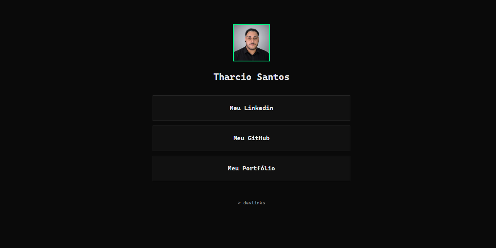

# DevLinks: Plataforma de Perfil e Linktree

[](https://github.com/tharcio09/frontend-api/actions)


Uma Single Page Application (SPA) Full-Stack desenvolvida para a criação e gerenciamento de páginas de links personalizadas (estilo Linktree). 

Este projeto atua como um produto SaaS completo, demonstrando o domínio do ecossistema JavaScript. Ele divide a arquitetura entre **Bastidores (Área Administrativa Privada)** e **Palco (Perfil Público)**, cobrindo o ciclo ponta a ponta: autenticação segura, gestão de estado global, upload de arquivos pesados para CDN e proteção de rotas.

---

## 🔗 Links do Projeto

* **Live Demo (Front-end):** [Acesse a aplicação na Vercel](https://frontend-api-weld.vercel.app/)
* **Repositório da API (Back-end):** [Acesse o código em Node.js/Express aqui](https://github.com/tharcio09/minha-api)

---

## 🚀 O que foi implementado neste projeto

* **Arquitetura Palco/Bastidores:** Separação clara entre o Dashboard de gestão (protegido por JWT, onde o usuário edita seus dados e links) e a página de perfil pública (`/p/:id`), acessível a qualquer pessoa na internet de forma segura.
* **Integração Contínua (CI/CD):** Pipeline automatizada com GitHub Actions rodando testes E2E do Cypress a cada *push* na *main*, garantindo a integridade dos fluxos críticos antes de chegarem em produção. O pipeline conta com rotinas de *teardown* para limpeza de dados de teste.
* **Upload de Imagens e Integração com CDN:** Manipulação de arquivos pesados no Front-end utilizando a interface nativa `FormData`. Comunicação ponta a ponta com a API (Node.js + Multer) para processamento e hospedagem de avatares na nuvem através do **Cloudinary** (CDN).
* **Gerenciamento Avançado de Estado e Cache:** Substituição do padrão tradicional de estado pelo **TanStack Query (React Query)**. Proporciona cache de dados e invalidação inteligente após mutações (adição e exclusão de links ou fotos), atualizando a interface gráfica em tempo real sem recarregar a página.
* **Autenticação de Ponta a Ponta:** Captura e envio seguro de credenciais, armazenamento de Token JWT e proteção de rotas através de um componente Wrapper (`<RotaPrivada>`).
* **UX e Feedback Visual:** Uso de notificações globais assíncronas (Toasts), recurso nativo de "Copiar para Área de Transferência" da API do navegador, e design responsivo com Tailwind CSS para garantir uma navegação fluida em qualquer dispositivo.

---

## 📱 Preview da Aplicação

### Tela de Login
Interface responsiva e moderna para captura de credenciais.


### Bastidores: Dashboard (Rota Privada)
Painel administrativo acessível apenas com Token JWT válido. Permite o upload dinâmico de avatar, gestão da vitrine de links e cópia rápida da URL pública.


### Palco: Perfil Público (Rota Pública)
A página oficial do usuário gerada dinamicamente, otimizada e segura, pronta para ser compartilhada em redes sociais.


---

## 💻 Como rodar o projeto localmente

1. Clone este repositório:
   ```bash
   git clone [https://github.com/tharcio09/frontend-api.git](https://github.com/tharcio09/frontend-api.git)
   ```
2. Instale as dependências:
   ```bash
   npm install
   ```
3. Configure as Variáveis de Ambiente:
   Crie um arquivo `.env` na raiz do projeto e aponte para a sua API (local ou em nuvem). Você pode usar o `.env.example` como base:
   ```env
   VITE_API_URL=http://localhost:3000
   ```
4. Inicie o servidor de desenvolvimento:
   ```bash
   npm run dev
   ```
5. Para assistir aos robôs de teste em ação, abra um novo terminal e rode:
   ```bash
   npx cypress open
   ```
