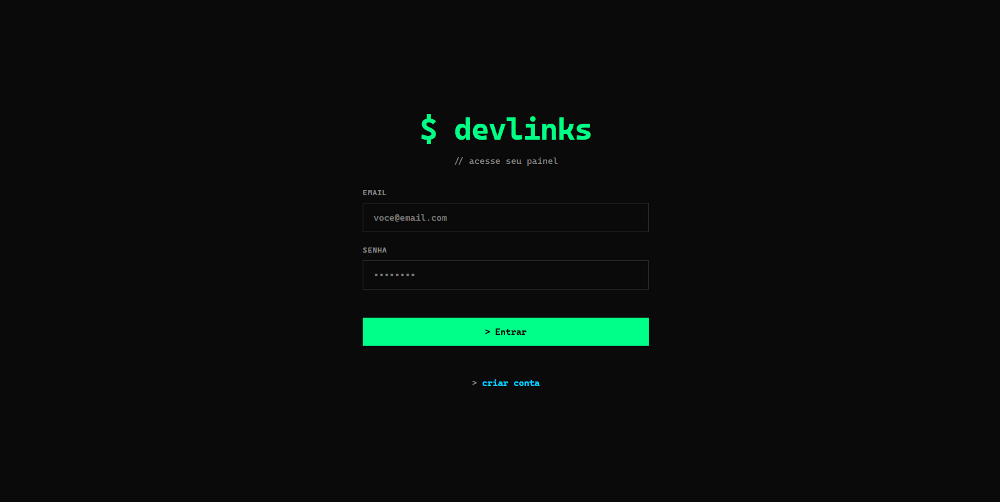
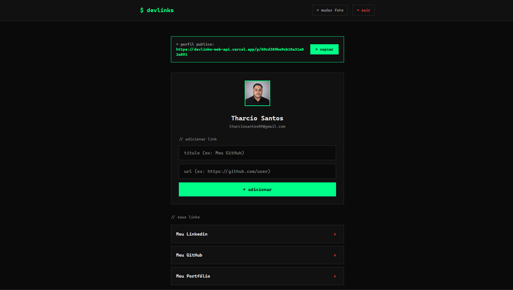

# Meu Frontend - Consumo de API com Autenticação JWT

Uma Single Page Application (SPA) desenvolvida em **React** para consumir uma API RESTful segura. 

Este projeto é a camada visual de um ecossistema Full-Stack, focado em demonstrar o ciclo completo de autenticação, desde a captura de credenciais, gerenciamento de rotas privadas com Tokens JWT, até testes automatizados de ponta a ponta.

---

## Preview da Aplicação

### Tela de Login
Interface responsiva e moderna para captura de credenciais.


### Dashboard (Rota Privada)
Painel administrativo acessível apenas com Token JWT válido, consumindo dados em tempo real da API.


---

## Tecnologias Utilizadas

* **React (com Vite)**: Biblioteca principal para construção da interface e renderização ultrarrápida.
* **Tailwind CSS (v4)**: Estilização utilitária de alta performance para um design moderno e profissional.
* **React Router DOM**: Gerenciamento de rotas (Navegação SPA) e criação de rotas protegidas.
* **Fetch API & LocalStorage**: Consumo nativo de endpoints e persistência do Token JWT no navegador.
* **Cypress**: Framework para testes automatizados Ponta a Ponta (E2E).

---

## O que foi implementado neste projeto

* **State Management e Ciclo de Vida**: Controle de formulários (Controlled Components) com `useState` e disparo automático de requisições com `useEffect`.
* **Autenticação de Ponta a Ponta**: 
  * Captura e envio seguro de credenciais.
  * Armazenamento do Token JWT no cofre do navegador.
  * Injeção do Token via Header (`Authorization: Bearer`) para consumo de rotas trancadas.
* **Rotas Privadas (Protected Routes)**: Componente Wrapper (`<RotaPrivada>`) que intercepta usuários não autenticados e redireciona para o Login instantaneamente.
* **Testes E2E (Cypress)**: Robô de testes configurado para validar o fluxo de login completo, preenchendo dados, validando o redirecionamento de URL e a renderização do Dashboard na tela.

---

## Estrutura de Pastas

A arquitetura do projeto separa claramente as responsabilidades:

```text
/
 ├── cypress/        # Suíte de testes automatizados E2E (login.cy.js)
 ├── docs/           # Imagens e assets para a documentação
 ├── src/
 │   ├── components/ # Componentes lógicos (ex: RotaPrivada.jsx)
 │   ├── pages/      # Telas completas (ex: Login.jsx, Dashboard.jsx)
 │   ├── App.jsx     # Ponto de entrada e central de roteamento
 │   └── index.css   # Diretivas globais do Tailwind CSS
```

---

## Como rodar o projeto localmente

1. Clone o repositório.
2. Certifique-se de que a API de Back-end está rodando na porta `3000`.
3. Instale as dependências: `npm install`
4. Inicie o servidor de desenvolvimento: `npm run dev`
5. Para assistir aos robôs de teste em ação, abra um novo terminal e rode: `npx cypress open`

---
