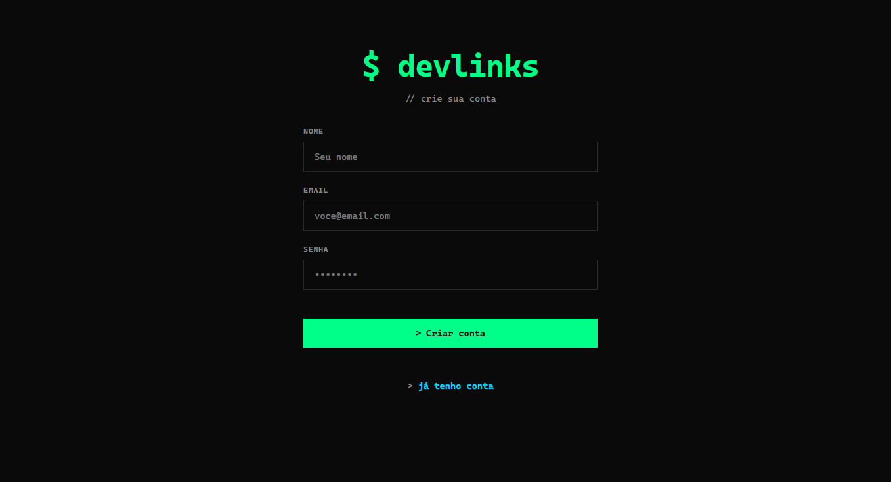

# Aplicação Front-end: Autenticação JWT & Dashboard

[](https://github.com/tharcio09/frontend-api/actions)


Uma Single Page Application (SPA) robusta e moderna, desenvolvida para demonstrar o consumo seguro de uma API RESTful. 

Este projeto atua como a camada visual de um ecossistema Full-Stack, cobrindo o ciclo completo de autenticação: desde o cadastro e login, gerenciamento de rotas privadas com Tokens JWT, até o controle de estado global e cache de dados com React Query, garantindo alta performance e resiliência.

---

## Links de Produção

* **Live Demo (Front-end):** [Acesse a aplicação na Vercel](https://frontend-api-weld.vercel.app/)
* **Back-end API (Render):** `https://minha-api-lih7.onrender.com`
* **Banco de Dados:** MongoDB Atlas

---

## O que foi implementado neste projeto

* **Integração Contínua (CI/CD):** Pipeline automatizada com GitHub Actions rodando testes E2E do Cypress a cada *push* na *main*, garantindo que quebras de código não cheguem em produção.
* **Gerenciamento Avançado de Estado e Cache:** Substituição do padrão tradicional de `useEffect`/`useState` pelo **TanStack Query (React Query)**, proporcionando cache de dados, tratamento de *loading/error* nativo e atualizações instantâneas de tela via Mutações (`useMutation`).
* **Autenticação de Ponta a Ponta:** * Captura e envio seguro de credenciais.
  * Armazenamento seguro do Token JWT.
  * Injeção automática do Token via Header (`Authorization: Bearer`) e tratamento de sessão expirada (Erro 401).
* **Rotas Privadas (Protected Routes):** Componente Wrapper (`<RotaPrivada>`) que intercepta usuários não autenticados e redireciona para o Login instantaneamente.
* **Ciclo CRUD Completo:** Criação (Sign Up), Leitura (Listagem protegida) e Exclusão de dados conectados ao banco de dados real.
* * **Feedback Visual Avançado:** Substituição de alertas nativos bloqueantes por notificações globais e assíncronas (Toasts), garantindo uma navegação fluida e UX de alto nível.

---

## Preview da Aplicação

### Tela de Login
Interface responsiva e moderna para captura de credenciais.


### Tela de Cadastro (Sign Up)
Formulário integrado com a rota pública da API para criação de novas contas diretamente pelo sistema.


### Dashboard (Rota Privada)
Painel administrativo acessível apenas com Token JWT válido. Utiliza React Query para garantir que os dados estejam sempre atualizados sem recarregar a página.


---

## Como rodar o projeto localmente

1. Clone este repositório:
   ```bash
   git clone https://github.com/tharcio09/frontend-api.git
   ```
2. Instale as dependências:
   ```bash
   npm install
   ```
3. Configure as Variáveis de Ambiente:
   Crie um arquivo `.env` na raiz do projeto e aponte para a sua API (local ou em nuvem):
   ```env
   VITE_API_URL=https://minha-api-lih7.onrender.com
   ```
4. Inicie o servidor de desenvolvimento:
   ```bash
   npm run dev
   ```
5. Para assistir aos robôs de teste em ação, abra um novo terminal e rode:
   ```bash
   npx cypress open
   ```

